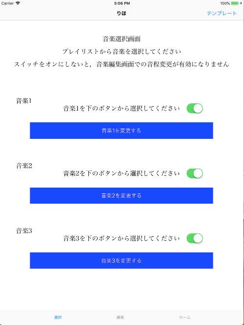
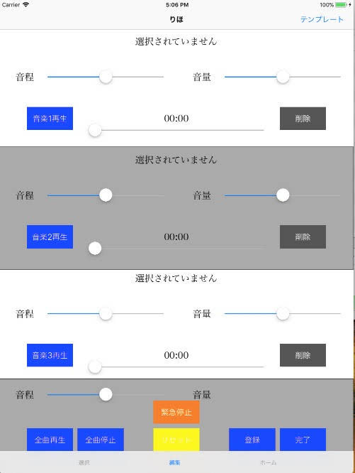

# SoundMixer - 発達障害児のための音刺激提示アプリ

## 概要
SoundMixerは、発達障害を持つ子どもや人がパニックや興奮状態にあるときに、音刺激を提示することで落ち着きを促すために開発されたiPad向けアプリケーションです。このアプリは、科学研究費助成事業（課題番号：２６５９０２６６）の支援を受けた「発達障害児へ提示する音刺激によるカームダウン誘発条件」研究プロジェクトの成果として開発されました。

## 研究背景と目的
発達障害を持つ子どもや人は、外部刺激に対する感受性が高く、パニックや興奮状態に陥りやすいことが知られています。本研究では、このような状態にある人に対して、適切な音刺激を提示することで落ち着きを促す条件を探るために、このアプリを開発・使用しました。

研究の結果、特定のヘッドフォンのノイズキャンセリング機能や自然音の有効性が示されましたが、発達障害を持つ個人は音に対する感受性などの点で大きな個人差があるため、落ち着きを促すための音刺激提示の一般的な条件は見つかりませんでした。

## スクリーンショット

## 主な機能

### 音楽再生と調整機能
- 複数の音楽トラック（最大3曲）の同時再生
- 各トラックの音量・音程・再生位置の個別調整
- フェードイン/フェードアウト機能で音の変化を滑らかに
- テンプレート保存機能で効果的だった音の組み合わせを記録

### メトロノーム機能
- BPMモード（1-250 BPM）と秒表記モード（0.15-5.0秒）の切り替え
- 視覚的なアニメーションによるリズム表現
- 音楽のBPM情報の自動検出と同期
- アニメーション表示/非表示の切り替え

### 外部デバイス連携
- 脳波センシングヘッドバンド（InteraXon MUSE）との連携
- 心拍計測デバイス（PULSENSE View）からのデータ取得
- 各種ノイズキャンセリングヘッドフォンとの互換性
- 骨伝導ヘッドフォンのサポート

## 使用方法

### 音楽選択と調整
1. ユーザープロファイル選択後、「選択」タブで再生する音楽を選択
2. 「編集」タブで各音源の音量・音程・再生位置を調整
3. 効果的な設定はテンプレートとして保存可能

### メトロノーム機能
1. 「ホーム」タブでメトロノーム機能にアクセス
2. スライダーまたは「速くする」「遅くする」ボタンでテンポを調整
3. 「BPM表記に」/「秒表記に」ボタンでモード切替
4. 「アニメーション表示」ボタンで視覚的なフィードバックのON/OFF切替
5. 「全曲再生」ボタンで選択した音楽トラックをメトロノームに合わせて再生

## 研究成果

本アプリを使用した研究では、以下の知見が得られました：

1. 特定のノイズキャンセリングヘッドフォンの使用が効果的
2. 自然音の提示が落ち着きを促す効果がある場合がある
3. 個人によって効果のある音刺激は大きく異なる
4. 心拍や脳波などの生体指標と音刺激の関連性

詳細な研究成果は[科学研究費助成事業研究成果報告書](https://kaken.nii.ac.jp/file/KAKENHI-PROJECT-26590266/26590266seika.pdf)で確認できます。

## 動作環境
- iPad Air（iOS 11.x以上）
- 外部デバイス（オプション）:
  - EPSON PS-100B Bluetooth
  - PULSENSE View（心拍計測）
  - InteraXon MUSE（脳波センシング）
  - 各種ノイズキャンセリングヘッドフォン/骨伝導ヘッドフォン

## 開発情報
- 言語: Swift 4.0
- フレームワーク: UIKit, AudioToolbox, MediaPlayer, AVFoundation
- 外部デバイス連携: Bluetooth通信

## 謝辞

本アプリケーションの開発および関連研究は、JSPS科研費26590266「発達障害児へ提示する音刺激によるカームダウン誘発条件」の助成を受けたものです。

研究代表者: 前田 晃士（MAEDA, Koji）

また、研究の実施にあたりご協力いただいた参加者の皆様、技術的サポートを提供いただいた関係者の皆様に深く感謝いたします。

## 注意事項

このアプリケーションは研究目的で開発されたものであり、医療機器ではありません。発達障害を持つ方の支援の一助として利用できますが、専門家の指導のもとでご利用ください。
